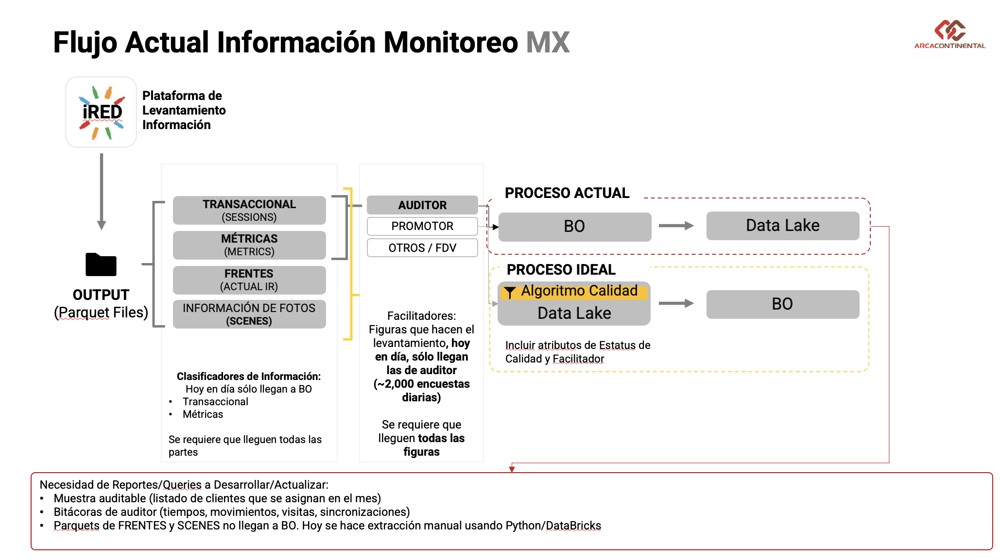
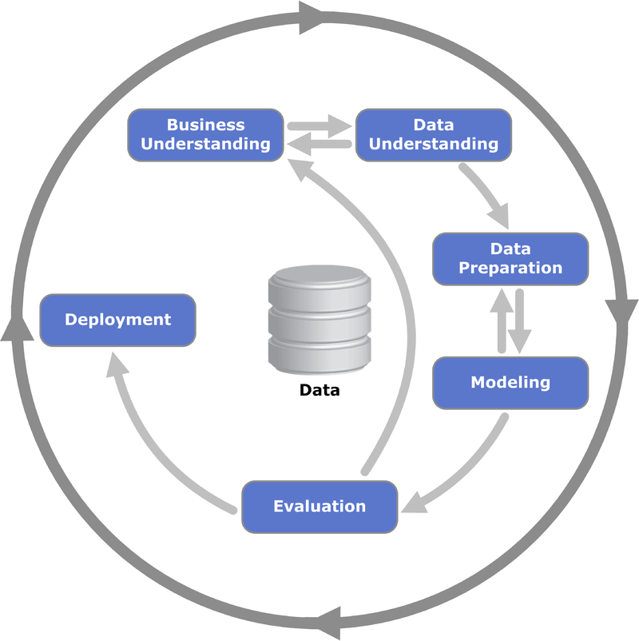

# Fuentes de Datos

Este documento describe las fuentes de datos utilizadas, formatos de archivo relevantes y los procesos de recolección y transformación de datos.

## ¿Qué son los Parquets?

El formato de archivo Parquet es un formato de almacenamiento en columna optimizado para el trabajo con grandes volúmenes de datos. Su diseño permite realizar compresiones altamente eficientes y mejorar significativamente el rendimiento de las consultas, lo cual es crucial para el manejo de big data. Parquet es ampliamente utilizado en el ecosistema de herramientas de análisis de datos, ya que permite almacenar y procesar datos de manera eficiente, minimizando el uso de espacio en disco y optimizando la velocidad de lectura.

### Colaboración con Maxerience

A la fecha de hoy (Marzo 2024), mantenemos una colaboración con **Maxerience** como nuestro proveedor de servicios de datos, utilizando su plataforma **iRED** para la recolección de datos. iRED es una plataforma versátil diseñada para llevar a cabo encuestas y programas de diversa índole, tales como censos, seguimiento de programas especializados, registro de frentes, productos en inventario, cantidad de enfriadores, entre otros.

### Uso de Parquets en la Recolección de Datos

Utilizamos archivos Parquet para comprimir y distribuir las grandes cantidades de datos recopilados a través de iRED. Aunque esta metodología ofrece una manera eficiente de manejar datos masivos, enfrentamos el desafío de que esta data aún no está "viva" dentro de un servidor accesible para su transformación y análisis en tiempo real. Sin embargo, estos datos pueden ser obtenidos directamente conectándose con Maxerience o mediante la conversión a archivos CSV para su uso convencional.

### Transformación de Datos

Conscientes de las limitaciones actuales y buscando optimizar la estructura de datos para análisis, estamos en proceso de convertir los formatos de Parquet a CSV. Este proceso se realiza a través de un script de Python, el cual facilita la transformación de los archivos Parquet a un formato más amigable para análisis convencionales. Encontrarán una copia de este script en la carpeta `helpers`, disponible para su uso y modificación según sea necesario.

## Flujo de Consumo de Información

Este repositorio documenta el proceso de validación de calidad diseñado para asegurar el control dentro de las etapas iniciales del flujo de información. Este control es crucial para filtrar y utilizar datos que reflejen fielmente la realidad, garantizando así la integridad y la utilidad de la información.

### Proceso Actual

El diagrama siguiente ilustra el flujo de información tal como se maneja actualmente. Este proceso implica una extracción y conexión directa con Maxerience por parte de los departamentos de TI y Analítica Avanzada. El objetivo es crear un data lake alimentado directamente por los archivos raw generados por los parquets de Maxerience. Idealmente, estos datos alimentarían a SAP Business Object (BO) para el desarrollo de un tablero accesible a toda la operación.

Sin embargo, la automatización completa del proceso aún no se ha logrado, lo que significa que una parte significativa depende de procesos manuales para la extracción y transformación de los datos.

### Entradas de Datos y Transformación

El proceso de transformación se basa en dos tipos de entradas de datos para producir información limpia, completa y de calidad:

- **Bases de datos empresariales**: Incluyen información sobre clientes, historiales de ventas, cantidad de enfriadores por sucursal, entre otros datos críticos para comprender el negocio.
- **Inputs de data cruda**: Datos directamente extraídos de los parquets, que requieren un análisis detallado para entender su contenido y cómo pueden ser procesados para su uso.

### Metodología CRISP-DM

Siguiendo la metodología CRISP-DM, nuestro enfoque para el uso de datos se desarrolla en etapas, comenzando por comprender el negocio y la data específica del proyecto CENSO. Este entendimiento guía las fases subsecuentes de preparación, limpieza y transformación de los datos.

  

Inicialmente, desarrollamos un compendio maestro de la información relevante para el negocio, unificando bases de datos y consolidando información que nos permite definir el contexto en el que opera el negocio y el proyecto. Este es el primer paso crítico para garantizar que los procesos de análisis y toma de decisiones estén bien fundamentados.

Posteriormente, es crucial analizar la data cruda para identificar los datos disponibles, determinar las necesidades de información y entender cómo integrar ambas fuentes de datos para una visión más completa. Aquí es donde los parquets y la data derivada de ellos juegan un papel esencial, siendo imprescindible entender el contenido de cada parquet para determinar el procesamiento adecuado.

Este enfoque estructurado y detallado garantiza que el flujo de consumo de información sea eficiente, efectivo y, sobre todo, alineado con las necesidades reales del negocio y los objetivos del proyecto.

## Bases de Datos Necesarias

Pending

### Master Clientes

### Bases extras

- Como dato
- OMD
- Usuarios
- Rutas

### SKU Master

## Inputs del Algoritmo

### Actual: Los Frentes detras de las Encuestas

### Manual Questions: Lo que Photo Recognition no puede detectar

### Scenes: La verdad detrás de la foto

### Session: Encuesta por Encuesta

### Survey: El elemento de Doble Validación
