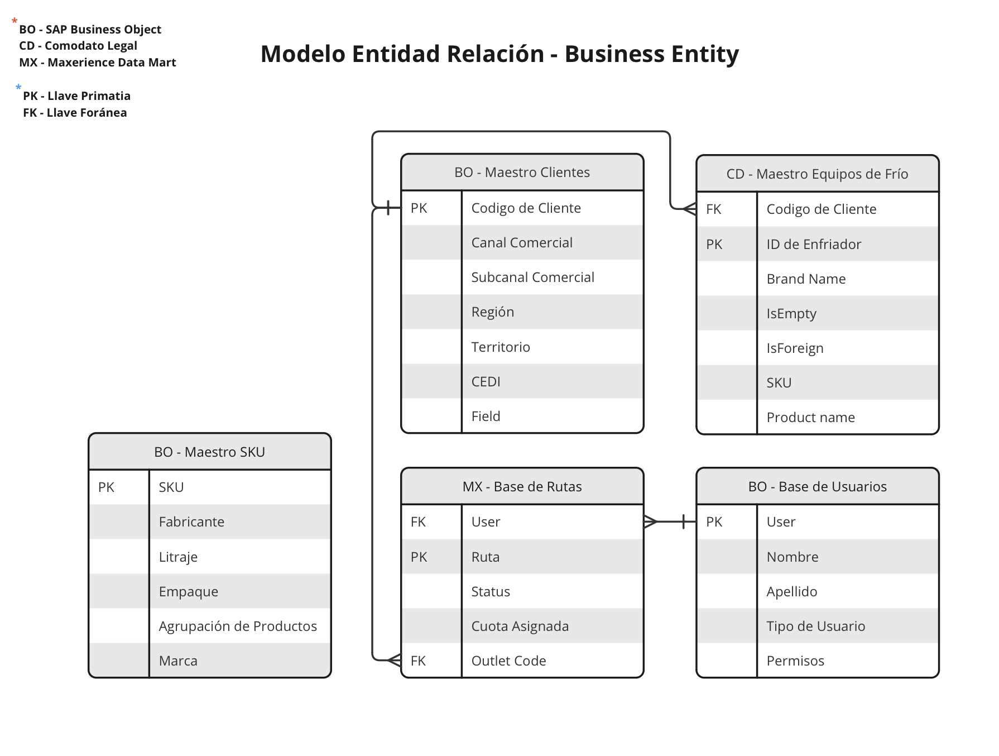

# Fuentes de Datos

Este documento describe las fuentes de datos utilizadas, formatos de archivo relevantes y los procesos de recolección y transformación de datos.

## ¿Qué son los Parquets?

El formato de archivo Parquet es un formato de almacenamiento en columna optimizado para el trabajo con grandes volúmenes de datos. Su diseño permite realizar compresiones altamente eficientes y mejorar significativamente el rendimiento de las consultas, lo cual es crucial para el manejo de big data. Parquet es ampliamente utilizado en el ecosistema de herramientas de análisis de datos, ya que permite almacenar y procesar datos de manera eficiente, minimizando el uso de espacio en disco y optimizando la velocidad de lectura.

### Colaboración con Maxerience

A la fecha de hoy (Marzo 2024), mantenemos una colaboración con **Maxerience** como nuestro proveedor de servicios de datos, utilizando su plataforma **iRED** para la recolección de datos. iRED es una plataforma versátil diseñada para llevar a cabo encuestas y programas de diversa índole, tales como censos, seguimiento de programas especializados, registro de frentes, productos en inventario, cantidad de enfriadores, entre otros.

### Uso de Parquets en la Recolección de Datos

Utilizamos archivos Parquet para comprimir y distribuir las grandes cantidades de datos recopilados a través de iRED. Aunque esta metodología ofrece una manera eficiente de manejar datos masivos, enfrentamos el desafío de que esta data aún no está "viva" dentro de un servidor accesible para su transformación y análisis en tiempo real. Sin embargo, estos datos pueden ser obtenidos directamente conectándose con Maxerience o mediante la conversión a archivos CSV para su uso convencional.

### Transformación de Datos

Conscientes de las limitaciones actuales y buscando optimizar la estructura de datos para análisis, estamos en proceso de convertir los formatos de Parquet a CSV. Este proceso se realiza a través de un script de Python, el cual facilita la transformación de los archivos Parquet a un formato más amigable para análisis convencionales. Encontrarán una copia de este script en la carpeta `helpers`, disponible para su uso y modificación según sea necesario.

## Flujo de Consumo de Información

Este repositorio documenta el proceso de validación de calidad diseñado para asegurar el control dentro de las etapas iniciales del flujo de información. Este control es crucial para filtrar y utilizar datos que reflejen fielmente la realidad, garantizando así la integridad y la utilidad de la información.

### Proceso Actual

El diagrama siguiente ilustra el flujo de información tal como se maneja actualmente. Este proceso implica una extracción y conexión directa con Maxerience por parte de los departamentos de TI y Analítica Avanzada. El objetivo es crear un data lake alimentado directamente por los archivos raw generados por los parquets de Maxerience. Idealmente, estos datos alimentarían a SAP Business Object (BO) para el desarrollo de un tablero accesible a toda la operación.

Sin embargo, la automatización completa del proceso aún no se ha logrado, lo que significa que una parte significativa depende de procesos manuales para la extracción y transformación de los datos.

### Entradas de Datos y Transformación

El proceso de transformación se basa en dos tipos de entradas de datos para producir información limpia, completa y de calidad:

- **Bases de datos empresariales**: Incluyen información sobre clientes, historiales de ventas, cantidad de enfriadores por sucursal, entre otros datos críticos para comprender el negocio.
- **Inputs de data cruda**: Datos directamente extraídos de los parquets, que requieren un análisis detallado para entender su contenido y cómo pueden ser procesados para su uso.

### Metodología CRISP-DM

Siguiendo la metodología CRISP-DM, nuestro enfoque para el uso de datos se desarrolla en etapas, comenzando por comprender el negocio y la data específica del proyecto CENSO. Este entendimiento guía las fases subsecuentes de preparación, limpieza y transformación de los datos.

  

Inicialmente, desarrollamos un compendio maestro de la información relevante para el negocio, unificando bases de datos y consolidando información que nos permite definir el contexto en el que opera el negocio y el proyecto. Este es el primer paso crítico para garantizar que los procesos de análisis y toma de decisiones estén bien fundamentados.

Posteriormente, es crucial analizar la data cruda para identificar los datos disponibles, determinar las necesidades de información y entender cómo integrar ambas fuentes de datos para una visión más completa. Aquí es donde los parquets y la data derivada de ellos juegan un papel esencial, siendo imprescindible entender el contenido de cada parquet para determinar el procesamiento adecuado.

Este enfoque estructurado y detallado garantiza que el flujo de consumo de información sea eficiente, efectivo y, sobre todo, alineado con las necesidades reales del negocio y los objetivos del proyecto.

## Bases de Datos Necesarias

  

El gráfico que has mencionado ilustra un diagrama entidad-relación (ER) que se centra en cómo se estructuran y se interconectan las bases de datos maestras dentro de una organización o proyecto. Estas bases de datos albergan información crucial que va desde los detalles de los clientes hasta los usuarios que están directamente involucrados en la ejecución de encuestas y censos.

La importancia de este diagrama radica en su capacidad para mostrar la relación entre distintas entidades y cómo interactúan entre sí para asegurar la integridad y el flujo adecuado de información. Esto es fundamental para mantener la calidad y precisión de los datos, aspectos cruciales para el desempeño efectivo de cualquier algoritmo que dependa de estos datos.

Para garantizar que se mantenga un orden y una estructura claros en estas bases de datos, es vital tener un glosario detallado que describa las variables (o columnas) asociadas a cada entidad. Además, es necesario desarrollar un modelo entidad-relación que detalle las conexiones entre las diversas bases de datos crudas, las cuales provienen originalmente de archivos en formato Parquet.

Este enfoque permite una mejor gestión y análisis de los datos, facilitando la implementación de mejoras y la detección de errores en las bases de datos, lo que, a su vez, contribuye a la optimización continua del proceso de análisis de datos y la toma de decisiones basada en información precisa y actualizada.

### Master Clientes

### Bases extras

Las siguientes bases de datos ayudan a dar complejidad y profundidad a la sabana maestra de clientes, asignando así información extra asociada a los clientes.

- **Comodato**: Proporciona información referente a los enfriadores con los que cuenta cada cliiente.
- **OMD**: Datos específicos del modelo de servicio que maneja cada cliente y mediante el cual se otorgan las cuotas esperadas.
- **Usuarios**: Información detallada de los usuarios que interactúan con el sistema de photo recognition mediante iRed.
- **Rutas**: Información sobre las rutas de que tiene cada promotor para atender a todos los clientes.

### SKU Master

La base de datos SKU Master contiene la información detallada de los productos, incluyendo descripciones, códigos, categorías, fabricantes y otros atributos relevantes. Esta base de datos es fundamental para el análisis de SOVI y ventas, permitiendo una gestión eficiente de los productos.

## Inputs del Algoritmo

### Actual: Los Frentes detrás de las Encuestas

Los datos de actual provienen de las encuestas realizadas en campo. Estos datos son recolectados y almacenados en archivos Parquet para facilitar su manejo y análisis. Cada encuesta cuenta con un numero de "frentes" y proporciona información detallada sobre el estado actual de los productos y servicios en los puntos de venta.

El proposito inicial de esta fuente de datos es mostrarnos los productos que son visibles al interactuar con los distintos puntos de contacto que tiene el cliente, y revelar cuales productos de Arca Continental así como de la competencia están presentes en los distintos puntos de vistas de los clientes.

De esta fuente de datos podemos obtener la información con respecto a la data de los productos, nos permite saber que participación tenemos, que productos son más presentes y cuales son ausentes.

### Manual Questions: Lo que Photo Recognition no puede detectar

Hay ciertos detalles que la tecnología de reconocimiento de imágenes no puede captar. Estas preguntas manuales en las encuestas cubren esos aspectos, proporcionando una capa adicional de datos que enriquecen el análisis y aseguran que se capture toda la información relevante.

### Scenes: La verdad detrás de la foto

Las escenas capturadas a través de fotos proporcionan una visión precisa del entorno en el que se realizan las encuestas. Estas imágenes son cruciales para validar y complementar los datos recolectados, asegurando que las interpretaciones y decisiones basadas en estos datos sean precisas y bien fundamentadas.

Los datos contenido dentro de esa fuente de datos son clave, ya que están vinculados con los _"flags"_ proporcionados por el proveedor de Photo Recognition y que nos da un vistazo de lo que podemos esperar de la foto. Otra información importante de las escenas son la identificación del tipo de POC con el que el promotor interactuo, si la foto refleja un POC Frio o Ambient, entre otras características de las fotos.

### Session: Encuesta por Encuesta

Cada sesión de encuesta se documenta minuciosamente, desde la creación del photo recognition hasta la recolección de respuestas manuales. Este registro detallado asegura la trazabilidad y facilita el análisis de la efectividad y precisión de cada encuesta realizada.

En la sessión podemos recopilar informaciópn con respecto a las características de la encuesta y su demografía, a que cliente se le hizo el censado, a que hora, en cuales coordenadas, cuanto dura la encuesta, entre otras.

### Survey: El elemento de Doble Validación

La doble validación es un proceso clave para asegurar la integridad de los datos. Cada encuesta pasa por una revisión exhaustiva para confirmar que los datos recolectados son precisos y completos. Este proceso de validación doble incluye la verificación manual y el uso de algoritmos automatizados para detectar inconsistencias y errores, garantizando así la calidad de la información utilizada en el análisis.

Survey es el filtro manual que nos permite utilizar la plataforma de [Portal Vision](https://portal.visioniot.net/login.aspx?ReturnUrl=%2fdefault.aspx) para hacer un filtrado de las encuestas que buscamos pasar por el algoritmo así como incluir filtros manuales que nos permitan tener un control sobre la data que estamos utilizando como input.

Esto es clave ya que si bien dentro del repertorio se encuentra el codigo vinculado a la actualización de [Parametros](ICD/parametros.Rmd), es necesario ingresar input no correspondiente o sucio puede sesgar a largo plazo los parametros como encuestas de auditores mal realizadas o incompletas que por default están siendo asignadas como aprobadas.
